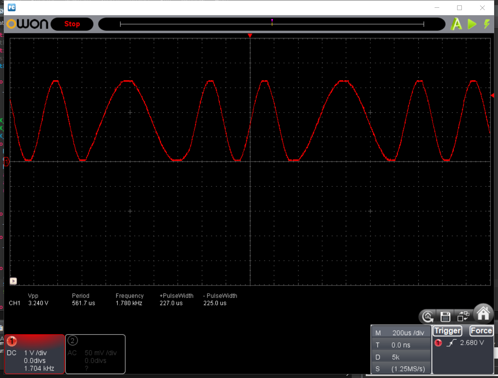
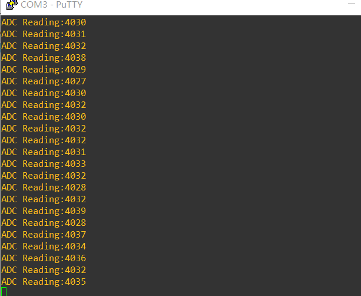
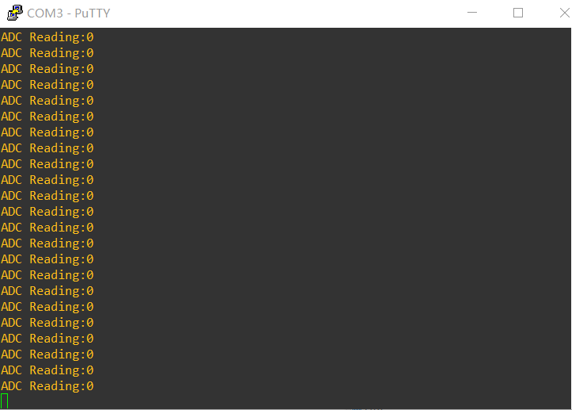

# M3 阶段进度报告

## DAC部分

目前DA的实现尽可能地借助了硬件。

### 正弦波

设计一个正弦波周期打256个点，DAC置于DMA模式下，由 TIM6 的 update event 触发转换。并且DMA使用环形缓冲模式。

Part of the configurations are done by CubeMX.
The _AFSK_Generator_ class does not cover every aspect of initialization.

```c++
auto s1 = HAL_DAC_Start_DMA(hdac, Channel, (uint32_t *)sine12bit.begin(), sine12bit.size(), DAC_ALIGN_12B_R);
auto s2 = HAL_TIM_Base_Start(htim);
```

因此，触发转换的间隔取决于定时器的 AutoReload Register. 触发转换的间隔决定了波形在时间方向上的拉伸。
对于 1200 Hz 和 2200 Hz 的正弦波，分别事先计算了 ARR 值如下。

```c++
// freq ctrl thru itvl between triggerings
static constexpr uint16_t ARR[] {84, 155};
```

### 相位衔接

另有一个用作时基的，设定 update event 频率为 1200 Hz 的定时器。
在 update interrupt 的回调函数中，更新当前传送的 symbol，通过写 TIM6 ARR 更新生成正弦波的频率。
由于 DMA 处于 circular 模式且始终没有重置，因此相位衔接是自然完成的，没有之前所预估的计算代码。
同时，在 CubeMX 启用了 TIM6 ARR 的 Preload 功能，使系统同步，减少出现玄学的概率。

```c++
auto set_itvl() { // assume preload enabled
    __HAL_TIM_SET_AUTORELOAD(htim, ARR[symbol]);
}
```

这种设计下，同时存在 1200 Hz 和 `1200*256` Hz 或 `2200*256` Hz 的定时器，且它们间是异步的。
这样可能会有同步问题，后面需要留意。

如果打开 TIM6 的定时器中断，自己计数来控制 symbol 更新，则中断触发太过频繁，主程无法执行。




## ADC部分

### 轮询启用ADC进行测试

工程从100转为051的工程，首先测试了ADC的使用，用轮询方式输出ADC寄存器对应数值（通过`HAL_ADC_GetValue`），分别将VCC以及GND引脚接入，显示如下：

接vcc时，输出接近4096



接gnd时，输出为0



启用ADC的测试通过。


### 尝试通过watchdog进行过零检测

`HAL_ADC_LevelOutOfWindowCallback`函数可以在watchdog模式下，当ADC的输出超出某个阈值时会触发该回调函数，可以考虑使用watchdog来进行过零检测。

但是尝试一段时间后发现无法触发该回调函数，因此重新尝试通过DMA来使用ADC。


### 通过DMA采集ADC数据

配置好ADC的DMA Request，Mode设置为`normal`，从而可以手动控制采样频率。

主循环中的`HAL_ADC_Start`每次调用则会启动一次采样。中断回调函数函数`HAL_ADC_ConvCpltCallback`可以在每次ADC完成采样后触发中断。

首先简单使用上述两种函数来通过DMA进行ADC的采样（主循环每进行一次则进行一次采样），并将ADC输入接入VCC和GND进行测试，测试结果与轮询的结果一致。


### TODO：通过DMA采集ADC数据，进行过零检测

可以在`HAL_ADC_ConvCpltCallback`中设置条件，保存先前的ADC寄存器的数值，记录其事件，并且在数值过零后通过一个全局变量来通知主函数过零事件的发生，来实现过零检测，进行该方法时需要计算一下采样频率，使得DMA不会漏掉部分过零的情况。