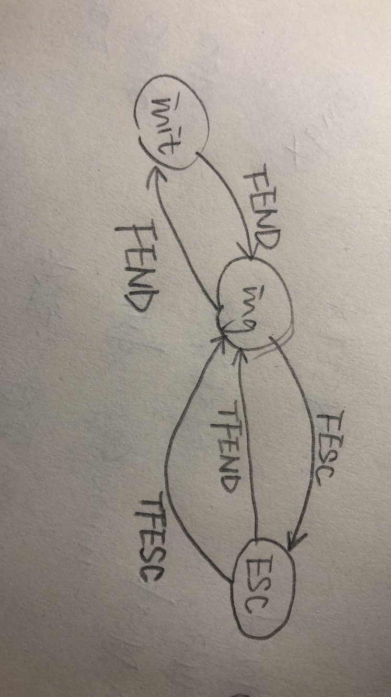

# M4 阶段进度报告

## DA

目前位置对应 *技术路线* **stage 3 发送一段刻意设计的编码（一段指定的01编码）**。在预期时间内，但还未能进行测试。

主要实现了一个缓冲区发送的方法，能够将一段外部传入的字节流以 AFSK1200 发送出去。

```c++
	auto requestTx(const uint8_t* buf, size_t len) {
		return q.fifo_put(buf, len);
	}
```

内部新增了一个环缓，同时每 1/1200 s 时隙的状态更新逻辑如下：

```py
	def update():
      if buffer empty:
         turn Tx off
      turn dac on or off according to Tx state
		if Tx on:
         symbol <- get next bit from the buffer 
			config dac to Tx symbol
```

位序：据 AX.25 Sect. 3, *All fields except the Frame Check Sequence (FCS) are transmitted **low-order bit first**.  FCS is transmitted bit 15 first.* 目前统一 **low-order bit first**, FCS 考虑做 bswap 后再放入环缓。

正弦波的产生由先前配好的 DAC, DMA 和 TIM6 硬件完成。

主程用于测试的一段字节流是 150 个 0x55, 对应 1 秒的 1200 与 2200 Hz 交替正弦波。示波器上观察结果相符。

**存在的问题**：

- direwolf 粗略浏览过，只找到了 ax.25 帧的配置选项。可能必须要发送一个组好的 UI 帧才能用上测试环境。一般字节流的测试未能进行，是个隐患。

**下阶段目标**：

- 再努力整整 direwolf, 测试目前的 DAC 逻辑
- KISS drv 部分完善后，联调测试

## KISS drv

实现了 KISS 终端 KISS_Receiver.

接受时的状态图如下



内部有一环缓，
生产者是 UART Rx Callback 将收到字符放入环缓，
消费者是 主循环 handle_buffer() 从环缓取字符，interpret 转义并填充存放最终结果的缓冲区。

发送时，将原始数据经过帧定界以及转义，即可交由下一级发送。封装的核心代码

```c++
out[olen++] = FEND; // 帧头
for (j=0; j<ilen; j++) {
  if (in[j] == FEND) { // FEND 转义
    out[olen++] = FESC;
    out[olen++] = TFEND;
  }
  else if (in[j] == FESC) { // FESC 转义
    out[olen++] = FESC;
    out[olen++] = TFESC;
  }
  else {
    out[olen++] = in[j];
  }
}
out[olen++] = FEND; // 帧尾
```

## AD解调部分：

**已完成内容：**在ADC将模拟信号转为数字型号后，通过Zero crossing的方式获取了信号各个零点之间的interval。

初次尝试中，使用time base 为50us来表示interval的长度，1200Hz频率的interval预计为8个time base，2200Hz频率的interval预计为5个timebase。

而在实际验证过程中，通过串口得到的interval长度的输出在4-9之间波动。实验中ADC的输入是源自于以及初步验证过的DAC部分，会不断发送01交替的正弦波。

**存在的问题**：

1. AD解调的结果无法进行验证，尚未搭建好对应的测试环境，如需验证，最好将调制前的01方波以及解调后的01方波在示波器上显示，对比其高低电平的长度来判断误差，由于目前怀疑用Zero crossing解调的结果存在较大误差，尤其在01交替处根据interval长度进行的判断极不稳定。

2. 即使完成了解调，距离输出01比特流还有一段距离，此时需要进行clock recovery，即接收端与发送段进行时钟周期的同步，以从解调后的信号中将对应的码元提取出来。

   关于这一部分在GitHub上找到一段较为有用的资料：[afsk-demodulator/afsk-demodulator.ipynb at master · mobilinkd/afsk-demodulator (github.com)](https://github.com/mobilinkd/afsk-demodulator/blob/master/afsk-demodulator.ipynb) 。该内容同时完成了解调以及解调后的clock recovery（并且在进行解调前还进行了相应的滤波以去频率范围外的噪声），所采用的方法不完全是Zero crossing而是一种信号处理中的滤波的方式，复杂度高于Zero crossing但是相应地低于FFT（快速傅里叶变换）。可以在下一个阶段中参考这一实现方式。

**下阶段目标**：

1. 改用不同优于Zero crossing的方式进行解调并进行解调后的验证；
2. 找到合适的clock recovery方法，并在解调后输出比特流。


