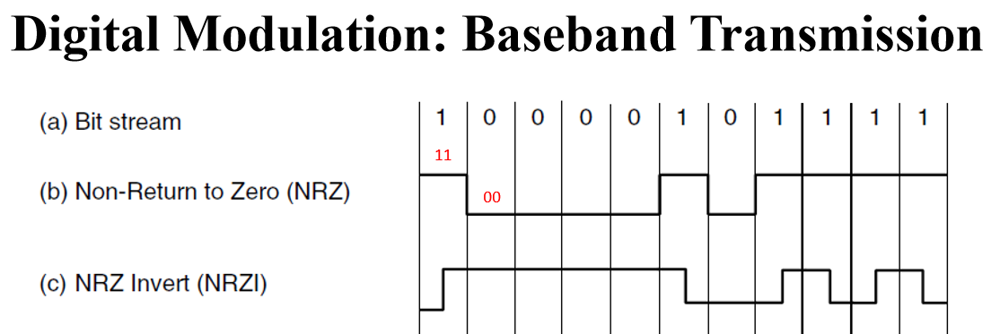

## DA

AFSK1200 Tx 修补了之前看文档没有注意到的细节：

- AX.25 的帧结构基于 HDLC, 应采用 **NRZI encoding**. 发送 0 比特时，在码元长度的一半处变换信号；发送 1 比特时，整个码元长度的信号不变。
- bit stuffing, 帧内每碰到 5 个 1 比特就暂停发帧，转而发 1 个 0 比特
- preamble, 启动 DAC 后，应先发送一段时间的 0 比特（对应信号频率在 2200 Hz 与 1200 Hz 交替）做引导序列，然后才发送真正的帧
- ref https://blog.csdn.net/meccaendless/article/details/78184734 , 使用缓冲的 DAC 输出并不能达到 GND 和 VCC, 导致之前实现的正弦波的正负峰值各被削掉一点点（所以虽然看着还行但总觉得不顺眼）。根据 051 的 datasheet 修正了正弦波码表 *sine12bit*

将 `KISS_Receiver` 合入了逻辑。051 从串口接受 KISS 帧，将其内容用 AFSK1200 调制后自 DAC 发出

## AD