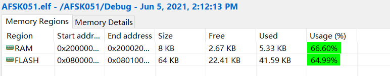

# M6

## AD部分

### 1.DMA实现更快的采样频率（在中断频率不变的基础上）

M5阶段在采样过程中遇到的中断频率过高导致无法运行的问题，听取老师建议后通过DMA一次读取多次采样的数据，理论上可以在合适的中断频率的基础上获取到很高的采样频率：中断频率为19.2KHz的情况下，DMA一次读取50个数据，可以实现960KHz的采样频率。

```c++
# ADC2_Value是一个50个半字长度的数组，ADC_BUFF_SIZE设置为50
HAL_ADC_Start_DMA(&hadc, (uint16_t*)ADC2_Value, ADC_BUFF_SIZE);
```


### 2.空间资源限制

本以为可以凭借这一点实现更高的采样频率，但是发现了另一个资源上的限制：栈空间的限制；

整个FFT进行的过程中至少需要创建4个相同大小的复数类的数组（输入与输出，以及运算过程中需要两个buff），相当占用非常多的空间，可以修改配置文件中的stack size来增大栈空间，但是这一操作不能无限增加，否则会超出RAM的限制导致报错。

而且通过CubeIDE的Build Analyzer工具，注意到在先前实验过程中由于没有注意flash空间和RAM空间，二者剩余的资源已经相当少了（发现这一点时二者的占用率都在80%-90%）。

为了减少空间资源开销，对先前代码做了一些调整（主要是改变变量类型，尽可能用更小的变量来运算），同时注意到浮点运算非常占用资源，所以在MCU setting中**将浮点运算的选项去除**，节省了很多空间。（操作后flash和RAM的占用率在60%左右）。




### 3.FFT存在的问题

【**简单概括：为了能够区分出1200Hz和2200Hz的频率分量，进行FFT必须要有充分的采样点数量，但是当增加采样点数量时，会面临栈空间容量不够的问题，STM32f051的RAM大小不足以让我们随意地创建大数组**】

即使空出了一定的空间资源，FFT依然无法良好地运行，原因如下：

在实验中使用的960KHz采样频率，一次采样50个点进行FFT。

注意到我们使用的是DFT，最后获取的是离散结果，需要通过公式$K=f*N/f_s$计算出索引，在对应的索引下找到载波频率的频率分量（其中$f$是载波频率，$N$是采样点个数，$f_s$是采样频率），如果采样频率过高而采样点数量不够，就会出现我们需要区分的两个频率分量（1200Hz，2200Hz）都被挤在一个位置下（例如在上述条件下将1200Hz和2200Hz带入公式，会发现所得的$K$都逼近于0）。

提高采样频率不能解决这个问题，也不能单纯提高采样点的数量，提高采样点的数量会导致每次的采样片段增长，最后产生的误差会增大（因为在同一段采样片段下，如果同时存在两个载波频率，fft的结果无法区分两个载波频率出现的时间，会产生一个采样片段长度的误差）。

解决这个问题可以通过zero padding的方式，即在采样点之后补0，这样可以在有效采样点数量不变的情况下，使得计算结果中不同频率能被区分开。

但是此时又要回到空间资源的限制上了，考虑对于上述采样频率，如果要能够区分出1200Hz和2200Hz的载波频率，至少需要在原来的基础上补15倍的0（采样点增加到16倍）。但是这远远超出了空间资源的限制：即使使用`complex<uint16_t>`作为复数类型，尝试过程中所能够给出的最大的采样点数量也就是128个（FFT的采样点数量需要是$2^n$个的，如果要达到预期的效果，需要1024个采样点。），超过这个数量程序将无法运行。

在这一问题上多次尝试各种压缩空间的方式，以及尽可能增大栈空间，但是都无法达到预期效果。`complex<uint16_t>`类的实部与虚部至少要占用4B的位置，而RAM大小只有8KB，剩余给栈空间的容量最多只能有6KB，如果取1024个采样点的话，至少会有两个长度为1024的复数类的buffer（长度至少有8KB）。直接使用这一方法来计算显然不可行。


