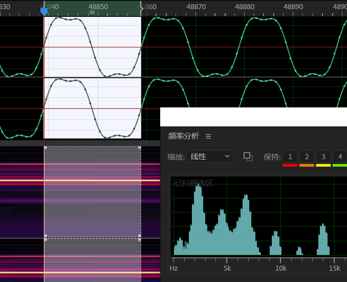
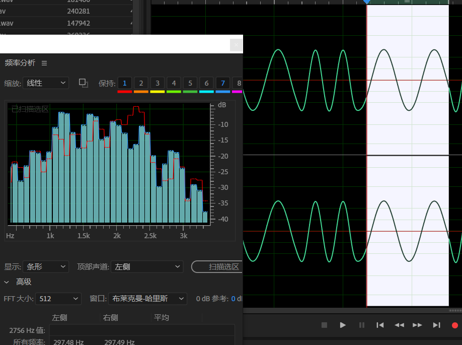
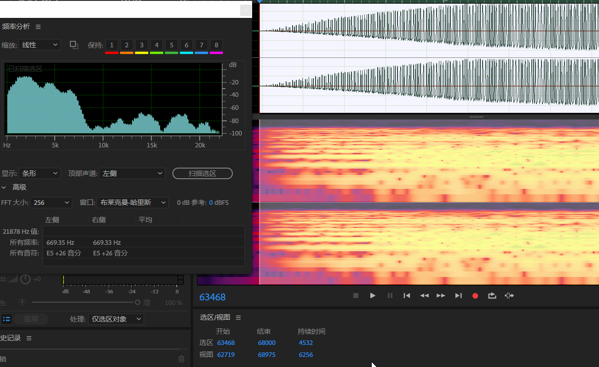
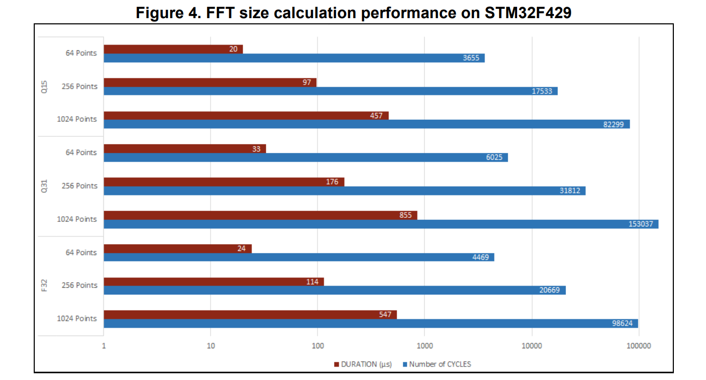
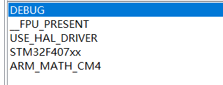
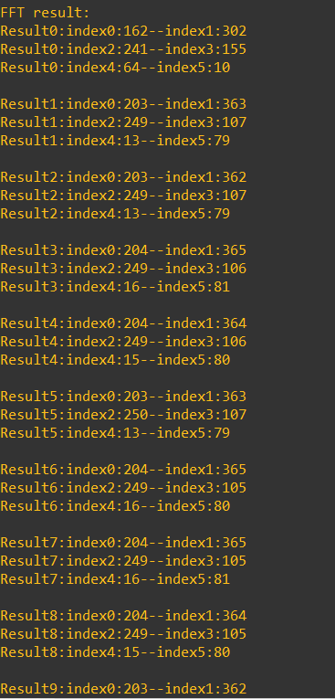

# M7 进度报告

## DA part

### Bug fixed

Short Answer:

1. DAC 给的电压太大
2. preamble sequence 不够长
3. KISSReceiver 忘记处理 command byte
4. 与上层开发组沟通不畅，都以为 FCS 和 帧头 是对方准备好
5. AFSK TNC Tx 状态机 code 的 bug: 忘记处理帧头（对就是这么离谱）；有 2 种情况少传了一个码元
6. FCS 算法及传输方式不对

这么一个集 naive, buggy, ... 于一身的 implementation 能 work 就有鬼了。

### Method used

Overall Approach:

- 没有办法，只能静下心来，test & fallback 确定 work 的部分，逼近不 work 的部分
- 肉眼仔细端详代码，同时与队友做 code review
- 上网查找参照
- <s> 在做不出来的原始恐惧驱动下日夜高强度 debug </s>

现在回想，其实当时 `M6.DA` 的逻辑链是有问题的：示波器上的波形正常，并不意味着音频波形就正常；中间的 interfacing 被想当然忽略掉了；也有些懒，不肯确实地端到端测一次。总而言之，线上电压太高，导致 interfacing 到 wgy 电脑音频接口，记录下的波形完全失真，并导致 `M6` 描述的玄学现象，被误认为 bug 原因是相位不连续 QAQ ; 后来，我重测以 1 秒周期交替 1200 Hz 和 2200 Hz, 在我的电脑上（可能音频接口电路设计更好些）观测到明显的削峰现象，如下图。试着减小正弦波码表的峰-峰值，波形明显改善。



同时确认了相位衔接的 idea 是正确的（当时 `M6.DA` 真的百思不得其解）



然 DA 发出的音频仍然不能被识别。但录下来的音频提供了许多信息。比如，我理解了为什么需要引导序列：DA 刚开始驱动时的线路信号质量非常差，引导序列填充了这段时隙，之后提供同步



然后我就人工对着录下来的波形，肉眼一个 bit 一个 bit 地解码。虽然很笨效率很低，但还算有效，解开头尾两三个字节就能发现一些问题；同时这也迫使我从 hex dump 层级审视整个流程。不断迭代眼花了两天，陆续发现并修正了 Bug 3 4 5

- suffered from lack of clear documentation
- 测试十分重要。一定要尽可能敏捷而全面地做测试，避免 unexpected technical difficulties


## AD part

### 转移工程到407上

单独把AD的工程移动到407上，重新配置timer，ADC，DMA等内容。

因为不用担心栈空间的位置，数组开得很足，运算改回浮点型。

顺便有些小问题，407配置里面串口的波特率明明是115200，但是putty这边接收必须设置成38400，不然收不到，比较迷惑。

### 改变AD部分逻辑

之前的代码里是在进行持续的采样以及FFT，然后FFT里面包含了串口输出用来查看结果。

这个方式很有问题，串口的输出当时只是为了快速获取到输出结果，但是因为串口通信非常耗时会打乱后面的采样等内容，结果无法预测。

所以重写了这部分内容，Demod类中包含一个buffer用来存放FFT的结果（每次结果虽然是一个大数组，但是只需要看前几位），攒到一定量的输出之后再在程序主循环里面统一输出，然后停止ADC的采样内容。保证整个FFT的过程不会受其他内容的干扰。

### FFT速度问题

用这种方式进行测试，发现一个比较大的问题。输出的速度非常慢，只是攒了20次FFT结果就需要等一段时间才有输出。因此对FFT的输出速度产生怀疑。

用定时器测了一下FFT的运算速度，在128个点的输入情况下，FFT的输出是毫秒级的（1ms左右），这完全无法接受（对于1200Hz的采波特率）。

FFT算法本身的效率必然没有问题，可能在实现过程中某些浮点运算非常耗时，而且考虑到当工程里面的FFT不存在什么硬件层面的改进，在单片机上的运算速度可能不如人意。

试图修改FFT内部运算逻辑以加速可能比较困难（数理基础不足），想到必然有人做过类似的工作，这里重新查了一下相关的实现方式。（FFT的速度应该早些考虑到，现在一直在最底层反复出现问题可谓十分头疼）

看到stm32f4是支持硬件层面的DSP运算的，其中所使用的所有数学函数都有在硬件层面的优化，比正常数学运算快10倍以上（源自官方说法）。

另附一张官方关于DSP运算的效率，微秒级，十分满意。



另外查到了一些在f1芯片上实现的DSP运算，也是有硬件层面的优化，但是说官方后面把这部分内容移除了（为了给f4让路），所以这方面只能找到一些民间流传（CSDN上）的资源。

### 采样频率变化

另外因为FFT上的多次失败让我重新考虑了关于采样上的问题，查了一些实例之后发现真实进行FFT的采样频率基本没有我们这么夸张的。我见过对AFSK的最高的采样频率是在48Khz，而我们采样频率在960Khz。当初之所以这么做，单纯想着进行fft的一段波形的长度要尽可能短，否则在01交替处误差会比较大，但是现在看来这想法相当错误（缺乏通信方面知识），过于夸张的采样频率也导致对于一定的采样点，必须补充非常多的0才能增大FFT的频率分辨率。所以现在按照常规方法走，对每1200Hz（即AFSK波特率）进行一次FFT，分为4次DMA的采样，每次采样130个数据点，一共520个有效数据点，实际参与运算的数据为512个（FFT输入必须为2的幂次）。

### f4上尝试DSP运算

尝试在f4上使用DSP运算，fft的核心代码其实只有下面两段:

```c
arm_cfft_f32(&arm_cfft_sR_f32_len512, fftData, 0, 1);
arm_cmplx_mag_f32(fftData, fftOut, SAMPLE_BUFFER_SIZE);
```

顺便在使用这一DSP库时发现我们之前的FFT还是存在问题的，输出的结果并不完全是频率分量，对于输出结果，每个索引内的数值还需要除以$N/2$，$N$为采样点数量。

但是配置DSP库时出现了一些麻烦，直接加入DSP运算的头文件和.lib后，编译时频繁出现缺少宏定义或者宏定义重复的问题。这方面踩坑花了一大段时间，网上的资料基本都不能work，官方在配置库方面的说明也非常简单。

最后不断对照头文件内容和报错提示，添加了三个宏定义：

同时注释了`stm32f407xx.h`里面的一个宏定义`_FPU_PRESENT`。（这里比较奇怪，g++似乎认这个宏定义但是gcc不认，经常在这个上面出现warning或者报错，所以干脆注释了）。



搞定上面的问题，尝试一下DSP的fft运算，先看下结果:



这里面输出的是FFT输出数组里面的前6位。ADC的输入是DAC发过来的正弦波，1200Hz和2200Hz以1s为单位交替。

直接观察结果还是相对符合预期，但是我在FFT参数上的设置还是有些不合理，发现1200Hz的部分和2200Hz的部分还没法区分。设置的FFT的频率分辨率是1200Hz，这使得1200Hz的频率分量可能在index1里面也可能在index2里面（只要有稍微的偏差就会落入另一个区间）。

之后很快会改一下这一设置，然后再合理地测试对于1200Hz和2200Hz的输入的区分度。

感觉一直在物理层的地方来回踩坑，很头大，对于信号方面的所知甚少导致经常走弯路。