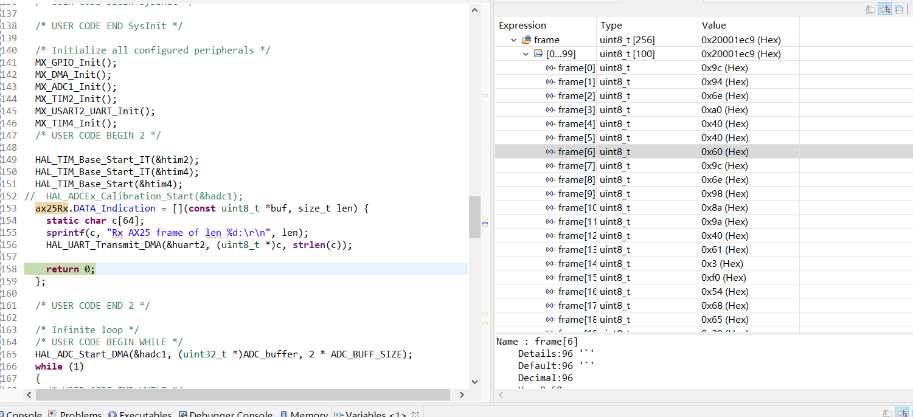
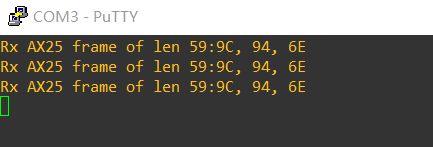
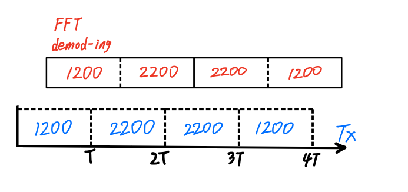
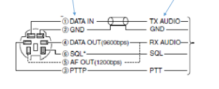

# AFSK： KISS modem M8总结报告

项目最后的测试环境（兼使用场景）简图：


## 1. AD part

### 1.1 最终成果

周三展示过后，我们继续开发，将物理层的解调模块和数据链路层的解码组帧模块组合了起来，测试解决了主时钟频率、时序、并行采样与解调的问题。**现在，AD 部分的 pipeline 基本拉通并能工作，通过 DA part 发送的一段 AX.25 数据帧可以被 AD part 成功接收，CRC校验通过，向上层发出 DATA Indication, 调试看到数据帧的内容正确。**

从051的DAC上，每隔一段时间发送一个Ax.25数据帧(内容如下)

```c++
static uint8_t ax25_frame[] = {
    	      0x9C, 0x94, 0x6E, 0xA0, 0x40, 0x40, 0x60, 0x9C, 0x6E, 0x98, 0x8A, 0x9A,
    	      0x40, 0x61, 0x03, 0xF0, 0x54, 0x68, 0x65, 0x20, 0x71, 0x75, 0x69, 0x63,
    	      0x6B, 0x20, 0x62, 0x72, 0x6F, 0x77, 0x6E, 0x20, 0x66, 0x6F, 0x78, 0x20,
    	      0x6A, 0x75, 0x6D, 0x70, 0x73, 0x20, 0x6F, 0x76, 0x65, 0x72, 0x20, 0x74,
    	      0x68, 0x65, 0x20, 0x6C, 0x61, 0x7A, 0x79, 0x20, 0x64, 0x6F, 0x67};
```

经过407的ADC解调并通过链路层解码，通过CRC校验后，对应的数据帧存放在`ax25Rx.frame`这一数据结构中，debug模式下检查其中所有内容（如下图右侧所示），可以看到与发送的数据帧完全一致（毕竟已经通过了CRC校验）。



测试时连续接受来自051发送的相同数据帧，同时在串口上输出帧长度以及数据帧前3个子节：同样验证正确。



按技术路线，收到的 AX.25 数据帧应以 KISS 封装，再从串口发给上层的单片机；这步对应的函数之前在 KISS driver 中已写好。此外还需接上那根晦气的耳机线，使用对讲机做无线传输的测试。然而与其他组的联调测试已不可能，所以最后这一部分无法进行。


### 1.2 项目难点以及应对措施

1. **硬件性能限制：**

   初次的工程在051芯片上进行，分别触及了不同方面的芯片性能的瓶颈而导致不断更换技术方案。

   + 时钟中断频率的限制：通过一次时钟中断函数下使用DMA进行多次ADC采样解决（同时适当减少采样频率）；

   + RAM空间限制：曾尝试在多处代码上减少空间资源利用，并微调FFT算法的空间开销（内部逻辑因为数理基础原因难以正确修改），但是因为051芯片RAM过小而最终难以通过可接受的精度运行。
   + 计算效率限制：将自定义的FFT运算换为stm32提供的DSP运算，同时适当降低采样点数以保证高于毫秒级的运算速度（最终的fft运算效率在500us左右）

2. **信号处理知识缺乏：**

   对信号处理方面知识的缺乏导致诸多不必要的问题，例如过高的中断频率实际上来自于过高的采样频率，而对于FFT运算，采样频率绝非越高越好。

   + FFT运算输入输出含义的理解：可以绕开FFT内部机理，直接理解其输入输出的含义，这也是正确调用DSP库的关键。注意ADC采到的值实际上是电压值，需要减上一个bias来表示实际采样值。

   + 频率分辨率：$R=F_s/N$，$F_s$为采样频率，$N$为采样点数量，如果需要能够区分1200Hz和2200Hz需要有合适的频率分辨率，同时这一公式可以看出在不改变采样总长度的情况下提高采样频率是没有意义的，频率分辨率不会增加。

     但是过高的采样点数会导致在解调方面误差过大，一段采样的总长度不能超过1/1200s，否则影响解调结果。为了在采样总长度不变的情况下保持一定频率分辨率，需要在实际采样点后补一定数量的0，这是FFT在进行解调过程中常用的trick（虽然一开始并没有注意到）。

     最后需要说明，FFT输出的是一个复数的数组，而频率分量是该复数的模长，如果需要忽略采样点数的影响，还需要将该值除以$N/2$。

3. **测试困难**：

   由于本项目过于底层，测试的思路不同于以往的桌面应用程序编程。项目很长一段时间限制于“肉眼测试”，“直觉理解”的测试方式，很难确定错误出现的位置。对于ADC部分来说，需要依次确定以下几个过程的正确性：

   + ADC单次采样正确（采样值为实际值）
   + ADC多次采样的频率正确（采样频率与设想频率一致）
   + FFT输入格式正确（针对DSP库的使用）
   + FFT运算结果正确（对于自定义的FFT运算我们需要确认这一点，后面采用DSP库之后就无需二次测试了）

   单次采样的结果通过接GNC和VCC来初步确认正确，更进一步需要接入段波形中连续采样并观察采样值是否有周期变换规律；

   采样频率是问题频出的地方，需要在时钟中断频率和ADC采样速度上进行谨慎的设置，并对一段频率已知的波形进行采样并查看采样值是否和预期的一致，此外，如果确定了FFT的计算结果是正确的，可以通过DSP库提供的三角函数，自己创建一段理想采样值输入FFT，对比采样结果，查看二者区别来确认是否正确。

   FFT输入格式同样通过输入一段理想采样值来验证，查看结果是否正确，以调制FFT输入格式（因为调用DSP运算中的不同的FFT运算时，输入有细微差别）。


### 1.3 工程代码说明

AD部分最终实现在407的工程上，除去自动生成的代码，我们的代码集中在以下几个文件中：

+ /Core/inc/Demod.h：实现demod类，其中包含与解调相关的代码；
+ /Core/inc/AX25_TNC_Rx.hpp:实现链路层接收Ax.25数据帧的状态机；
+ /Core/inc/crc.h: 进行crc校验；
+ /Core/inc/FastFouier.h：自定义的FFT算法头文件（因效率不足被放弃）；
+ /Core/Src/FastFouier.cc: 自定义的FFT算法代码（因效率不足被放弃）；
+ /Core/Src/main.cc： 主循环所在的C++文件。

其中为调用DSP库相关运算，也包含了如下文件,主要是必要的数据结构以及加速数学运算的定义，以及FFT相关运算的定义：

+ /Core/inc/arm_common_tables.h

+ /Core/inc/arm-const_structs.h

+ /Core/inc/arm-math.h

+ /Core/Src/BasicMathFunctions

+ /Core/Src/CommonTables

+ /Core/Src/FastMathFunctions

+ /Core/Src/TransformFunctions


### 1.4 重要细节说明

解调部分的代码本身非常简短，项目的主要难度在于为调整调制结果而不断进行的优化，以及对于FFT进行解调的正确方式的摸索（包含对FFT的使用）。弃用的自定义FFT运算，以及各种弃用的技术方案将不在这里说明（忽然就显得这里十分单薄，实际上弃用的代码量远大于此处说明的内容）。

#### 1.4.1 **FFT核心代码：**

```c++
arm_rfft_fast_f32(&S, fftData, fftOut, 0);
//arm_cfft_f32(&arm_cfft_sR_f32_len256, fftData, 0, 1);
arm_cmplx_mag_f32(fftOut, fftResult, maxSamplePoint);
arm_max_f32(&fftResult[1], maxSamplePoint - 1, &max_value, &max_index);
max_index++;
```

调用DSP库的FFT运算的核心代码只有这四行。

`arm_cfft_f32`是DSP库的复数fft运算（通过两个浮点数表示一个复数），其输入是2的幂次个复数，由第一个参数指明，最后两个参数分别代表是否进行逆FFT运算以及bit reverse操作，默认都是设置为0和1。

这一函数可以运行但是效率不如`arm_rfft_fast_f32`，故采用后者，其输入是一组实数（即采样值），其中第一个参数是进行该运算时需要初始化的一个结构体，初始化时需要制定fft点数（同样需要是2的幂次）

```c++
arm_rfft_fast_instance_f32 S;
arm_rfft_fast_init_f32(&S, samplePointsNumber);
```

FFT的输出需要进一步计算复数模长来得到频率分量，因此需要使用`arm_cmplx_mag_f32`，求出幅值作为输出。

`arm_max_f32`取给定浮点数组中最大的数以及其索引，这一函数是stm提供的在M4指令集上的加速函数，有着汇编级别的优化，因此比直接实现更快。

注意一个细节，fft输出的第一个数不传入``arm_max_f32``中，因为这是0Hz的直流分量，不予以考虑，故而最后的max_index也需要增加。

最后只需要根据频率峰值所在的位置，结合频率分辨率（本项目的频率分辨率为150Hz）即可知道采样波形中最大频率分量。

需要注意到结果仍然存在误差，这是因为**频谱泄漏现象**，信号处理中通常通过增加窗函数的方式（其实质是一种卷积运算）来减少误差，不过这里因为我们只需要精确区分1200Hz和2200hz即可，一定的误差仍然是可以接受的，故而不需要这一步处理。

本项目进行的FFT运算为256点的FFT运算，而ADC在每轮的采样过程中只会采集32个点，这是为了保证足够的频率分辨率，因此其他点需要补0，因此进行FFT之前数据需要做如下处理。

```c++
uint32_t i;
for (i = 0; i < validSamplePoint; i++) {
    fftData[i] = sampleInput[i];
}
for (; i < maxSamplePoint; i++) {
    fftData[i] = 0.0;
}
```

#### 1.4.2 ADC采样配置

ADC的采样通过TIM2的时钟中断触发，并通过DMA获取采样值，具体配置如下：

**TIM2配置：**为满足 1200Hz\*32的采样频率，将ARR值设为2186 (TIM2的时钟频率为84M，84M/(1200\*32)-1=2186). 同时 TRGO `Trigger Event Selection` 设置为 `update Event`，意味着将通过 TIM2 AutoReload 事件来触发ADC采样。

**ADC采样设置**：`External Trigger Conversion Source `为`Timer2 trigger out event`。

**DMA设置**：Circular模式，double buffering，每个buffer存放32个采样数据。

```c++
#define ADC_BUFF_SIZE 32
int32_t ADC_buffer[2][ADC_BUFF_SIZE]
```

FFT 解调是耗时操作，过程中 ADC 必须继续采样下一个码元，否则相当于每个码元接收都阻塞，时序直接爆炸。因此留出第二个buffer，继续存储 ADC采样值。经过测试，本项目中 一次 FFT demod 耗时 600 us, 因此在 DMA 回绕到第一个 buffer 之前，第一个 buffer 就会结束使用。


ADC完成转换后触发回调函数，两个buffer分别使用两个回调函数：

```c++
void HAL_ADC_ConvHalfCpltCallback(ADC_HandleTypeDef *hadc) {
	for (int i = 0; i < 32; ++i) {
		ADC_buffer[0][i] = (ADC_buffer[0][i]-699) * 5;
	}
	ax25Rx.Rx_symbol(demod.DSPFFTDemod(ADC_buffer[0]));
}

void HAL_ADC_ConvCpltCallback(ADC_HandleTypeDef *hadc) {
	for (int i = 0; i < 32; ++i) {
		ADC_buffer[1][i] = (ADC_buffer[1][i]-699) * 5;
	}
	ax25Rx.Rx_symbol(demod.DSPFFTDemod(ADC_buffer[1]));
}
```

#### 1.4.3 链路层接收Ax.25数据帧状态机



同步：物理层直接以1200Hz进行解调，与AFSK协议的波特率一致。我们假设，如果 FFT 的样本跨过了码元边界，则 FFT 解调结果为所占时间长的那个码元，如上图。经过实践，这个猜想是对的。因此链路层不再做更多的同步操作。

Ax.25 Rx FSM 一共两个状态：**FEND**与**FRAME**. 前者对应Ax.25帧定界符的部分，后者用于接收两个Ax.25帧定界符间的数据。

+ **FEND** 状态下，不断进行NRZI解码，在比特流中寻找 0x7e 字节。帧定界符意味着一个Ax.25帧的开始或结束（当然，也可能是连续的帧定界符），我们通过此时buffer的size来区分。如果是帧结束，将进行CRC校验，确认校验无误则用该数据帧发出 DATA Indication. 无论如何都将重新初始化 buffer 并进入**FRAME**状态。
+ **FRAME** 状态下，不断进行NRZI解码，同时需要注意解码过程中去除bit stuffing所增补的0，不断将比特存储在buffer中，一旦接收到连续的6个1，则认为可能是帧定界符，将进入**FEND**状态。

## DA part

### 2.1 最终成果

对照技术路线，除了未能使用对讲机做无线传输的测试，其他目标都完成了。如首页简图所示，**上层以 KISS 封装发来的 AX.25 帧请求能够被成功组帧、编码并调制，在耳机线上传输的模拟信号接 PC audio, 能够被 direwolf 识别（CRC校验通过）接收，在软件 UI 上显示出正确的数据帧内容。**

除了 pre PPT 展示的截图，还有一段视频演示 DA-res.mp4 随附。由于耳机线拉垮，这段演示中我们只能用手小心地将 DA 引脚 和 耳机线的信号线束 搭接起来orz 

### 2.2 工程代码说明

DA 部分目前实现在051的工程上，除去自动生成的代码，我们的代码集中在以下几个文件中：

+ /Core/Src/crc.h: shared ax25 crc implementation
+ /Core/Src/CircularQueue.hpp: struct CircularQueue is a simple ring buffer implementation used by `class AX25_TNC_Tx`
+ /Core/Src/AX25_TNC_Tx.hpp:
  + class AX25_TNC_Tx: Handle the transmission of frames, including preamble sequence and frame delimiter. Handle states and coordinate; Maintain frame queue;
  + class AFSK_Modulator: Handle the DAC to emit the actual sine wave, with symbols defined in AFSK1200. The indirect manipulation with DMA and TIM ensures the smoothness of symbol transition
+ /Core/Src/KISSReceiver.hpp: class KISS_Receiver handles KISS frame encapsulation and reception
+ /Core/Src/main.cc: 主程调用 `class AX25_TNC_Tx` `class KISS_Receiver` 提供的接口

### 2.3 测试流程及遗留问题

因为缺乏模电经验，一开始对DA进行测试时没有考虑到电平高低问题，通过耳机线直连声卡的设计不安全，不同主板上的音频口对此情况的处理不同，在thinkpad上收到的总是不规则波形，无法从这个波形去推断可能的原因。偶然转到另一台dell上时，可以通过录音接收到明显的，波峰被削平的波形，由此推断出是交流电振幅过大引起了声卡采样的失常。在连接某精密器件之前，应先调查该器件的适用信号输入范围，对参数不容易查到的器件，应增加一个变阻器，确保输入信号在安全范围内。

对于输入声卡的波形，direwolf软件只能给出“对”和“不对”的判定，如果答案是“不对”，无法在此基础上进行进一步的分析。测试中使用的音频录制软件是Adobe AU，它有强大的频谱分析功能，但无法直接对原始波形中的一些信息（例如编码）进行快速统计。但小组中没有人有音频编程的经验，最后是gzl通过人力分析波形的方式查找可能的问题（见M7）。



DA与码工盒子进行对接时，采用的是用杜邦线公头插S端子数据口和地线的方法。考虑到S端子的读入电平限制，用一个变阻器对输出信号进行了分压处理，遇到的问题是用电表交流档检测不出输入线上电压的变化，在各个点上的电压值（除了直连地线）都是同一示数。即使换成一串等值电阻搭建的电路也还是如此，电阻电路经测试也没有开路，有点百思不得其解。目前码工盒子的S端子口还不能解出DA发出的信号，对讲机那边的接线还没有做好。

AD的板子没有焊排针，在测试时因线路开路意外问题得不到正确测试结果。避免此类事件的方法是在使用器材之前先处理好接线问题，在程序测试之前先完成线路的测试。此外，鳄鱼夹这类接口在测试中比杜邦线要好用。

