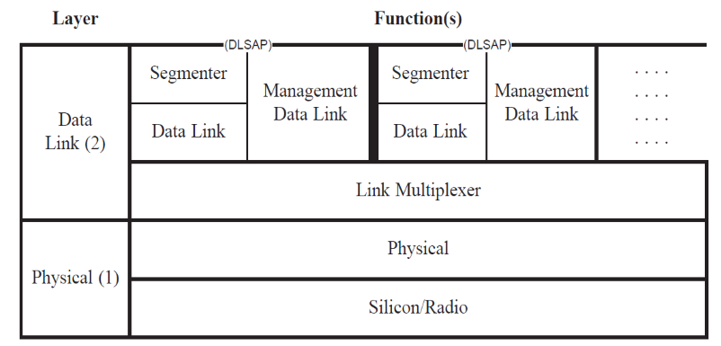

# YAN网络数据链路层需求分析报告

## 1.概述

### 1.1 项目背景

YAN网络是嵌入式系统提出的网络，主要参考APRS网络。本项目旨在实现一个具有APRS网络基本功能的YAN网络并在其上落实一个具体的应用/

### 1.2 总体目标

本小组负责YAN网络数据链路层的KISS Modem for AFSK，旨在实现一个AFSK的调制解调器，其一段以音频线接对讲机，一端以串口接其他单片机，通过KISS协议和单片机通信。小组所负责的内容在整个YAN网络位于最底层的位置，通过OSI模型来描述即需要实现物理层和数据链路层两部分的功能。

需要实现ax.25协议所实现的部分乃至全部功能（而ax.25协议本身是位于物理层和数据链路层的协议），从而为更为上层的网络层提供服务。

## 2.目标系统功能需求

具体需求主要从两个方面来说明：

其一是物理层，旨在通过一个AFSK的调制解调器讲数字信号调制为模拟信号发送，或是接收模拟信号并解调为数据信号，实现基本的数据收发功能

其二是数据链路层，对于从物理层接收到的信号，将面向比特的信号转化为面向帧的平滑，基本无错的数据传输给更高层；对于上层发送下来的数据包，进行必要的分段并追加一些头，交由物理层进行传输。

在具体说明两层的需求之前，需要给出ax.25文档中所阐明的关于ax.25的结构，以便更好理解项目需求；

简要说明一下其中各个部分的含义：

**DLSAP（Data-Link Service Access Point )**:数据链路层提供给上层的接口，每个data link中含有一个DLSAP；

**Management Data Link**：管理Data link相关参数的状态机，每个datalink中含有一个该状态机；

Data Link : Data link层核心部分，控制大多数关键原语（建立/释放连接，传输数据等）的状态机，每个datalink中含有一个该状态机；

**Segmenter**:对上层传输下来的数据包进行必要的分段，每个datalink中含有一个该状态机；

**Link  Multiplexer:**该状态机决定那个data link当前能够使用信道，从而使得多个data link共享一个物理信道，每个物理信道有一个该状态机；

**Physical**:控制底层硬件的状态机；

ax.25的文档给出了所有内容的具体细节，我们需要结合项目需要，选择其中必须实现(基本需求)以及可以实现（进阶需求）的部分。

### 2.1 物理层需求

#### 2.1.1 基本需求

#### 2.1.2 进阶需求

### 2.2 数据链路层需求

#### 2.2.1 基本需求

#### 2.2.2 进阶需求

## 3.目标系统接口需求