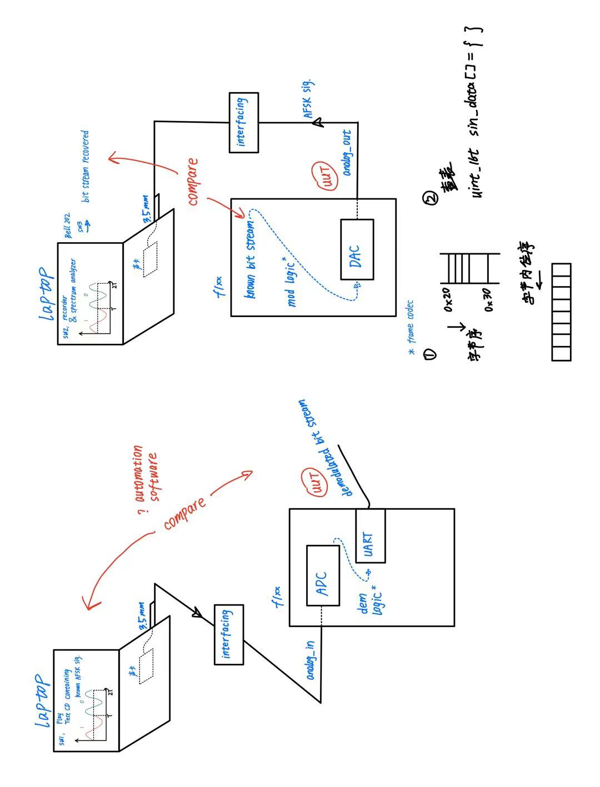

# 选型与技术方案

## 1.硬件选型

STM32F100系列：Cortex-M3指令集，24MHz CPU，内置ADC与DAC，符合Kiss modem收发正弦波的需要。

## 2.软件选型

项目使用无操作系统的单片机实现，使用STM32CubeIDE进行开发，使用STM提供的HAL库。

## 3.开发技术路线

项目的开发分为两条路线进行，分为正弦波的发送（DAC）以及正弦波的接收（ADC）两条主线，在开发过程中使用两套独立的测试环境，互不干扰且可以并行进展。

项目截至日期为学期末，考虑到最后需要留出一段时间和网络层一同进行调试，需要留出4周时间，故从当前时间开始（3.29）开始共有9周时间（到5.26为止）。

### 3.1 DAC路线

| 阶段分级    | 阶段目标                                                     | 测试环境                | 阶段时限  | 备注                                                    |
| ----------- | ------------------------------------------------------------ | ----------------------- | --------- | ------------------------------------------------------- |
| **stage 0** | 寻找对标的工程资料以及测试用的解码软件;                      | 无                      | 3.29-4.4  |                                                         |
| **stage 1** | 能够驱动DAC发送单一频率正弦波；                              | STM32+示波器            | 4.4-4.14  |                                                         |
| **stage 2** | 能够发送相位连续的符合AFSK要求的正弦波（1200 bps，由1200Hz/2200Hz调制而成）； | 需要建立4.1中的测试环境 | 4.14-5.8  | 预测stage 2是本次项目的难点所在，可能需要花费较多时间。 |
| **stage 3** | 能够发送一段刻意设计的编码（一段指定的01编码）；             | 需要建立4.1中的测试环境 | 5.8-5.12  |                                                         |
| **stage 4** | 能够发送来自APRS协议的UI帧；                                 | 需要建立4.1中的测试环境 | 5.12-5.19 | 5.19-5.26依据当时实现情况进行安排                       |

### 3.2 ADC路线

| 阶段分级    | 阶段目标                                                 | 测试环境                               | 阶段时限  | 备注                                                    |
| ----------- | -------------------------------------------------------- | -------------------------------------- | --------- | ------------------------------------------------------- |
| **stage 0** | 寻找对标的工程资料以及测试用的音频资料                   | 无                                     | 3.29-4.4  |                                                         |
| **stage 1** | 能够接收并识别单一频率的正弦波；                         | 通过stage1 测试的正弦波输入到ADC模块中 | 4.4-4.14  | 需要在DAC路线的stage完成后再进行                        |
| **stage 2** | 能够接收经过AFSK编码的信号，并将其解调为对应的数字信号； | 需要建立4.2中的测试环境                | 4.14-5.8  | 预测stage 2是本次项目的难点所在，可能需要花费较多时间。 |
| **stage 3** | 能够接收来自APRS协议的UI帧并将其解码                     | 需要建立4.2中的测试环境                | 5.12-5.19 | 5.19-5.26依据当时实现情况进行安排                       |

## 4.测试环境

上图分别展示了DAC（右侧）和ADC（左侧）的测试环境。其中重要的硬件/软件成分由黑笔画出，蓝色为注解，红色为测试逻辑。

共同点：一台拥有音频输入/输出功能（隐含要求声卡有编码/解码的API）的计算机，以及其音频接口。
这里我们假设是常见的 3.5 mm 耳机接口。尽管粗看资料显示 3.5 mm 耳机线的构造简单，但可能仍需进一步试验以确定与 STM 模拟引脚的 interfacing 方式。

[构造](https://zh.wikipedia.org/wiki/TRS%E7%AB%AF%E5%AD%90)

### 4.1 DAC测试环境

DAC（右侧）的测试环境中，将给定的比特流（星号表示需要考虑比特流的存储方式，并且这部分协议可能需要与上层协商确定），
经由我们码出的调制逻辑，以及 HAL DAC 驱动后，模拟信号输出，为待测单元（Unit Under Test）. 
假设模拟信号无损传输到电脑声卡，并被解码。
这时我们需要软件（以 SW2 指代），对于解码后的结果进一步分析。它至少应该记录信号的频谱，以便后续推算某个时隙的比特；最好能够一步到位，按 Bell 202 协议把最后的比特流直接还原出来（记为  SW3 ）.

### 4.2 ADC测试环境

ADC（左侧）的测试环境中，电脑有一段给定的AFSK信号，以某种方式编码（以 SW1 指代）（这里我们假设播放一份包含测试音频的 CD）自 3.5 mm 口输出。
假设模拟信号无损传输到 F100 模拟输入，并被 HAL ADC 驱动解码成采样流。
采样流经由我们码出的解调逻辑，得到比特流，为 UUT. 可以从 UART 口输出以供比较。

### 发现的问题

除了前面提到的，需要寻找一个聪明的对照方式，尽量自动化

## 5.项目参考资料

- 对标项目，多为arduino
  - https://github.com/kronenpj/kiss-avraprs
  - https://github.com/robots/APRS/tree/master/bertos
- Win/Linux声卡解码软件
  - https://github.com/wb2osz/direwolf